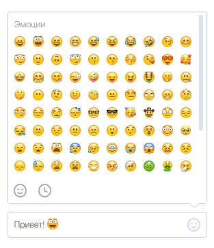

# Тестовое задание для стажировки в команду веб-мессенджера

### VK_emoji_test_job

---
Ссылка для предварительного просмотра на [GitHub Pages](https://vacym.github.io/VK_emoji_test_job/)

**Основная задача**

> Выполнена

- Поле ввода изменяет размер в зависимости от количества введённого текста

- При нажатии на иконку смайлика открывается выпадающий интерфейс выбора эмодзи

- В интерфейсе выбора эмодзи внизу есть 2 иконки. Они переключают режим просмотра между всем списком и недавно использованными эмодзи

**Дополнительная задача**

> Не выполнена

- Не находятся и не подсвечиваются в поле ввода упоминания, хештеги, ссылки и адреса электронной почты.

**Собственные дополнительные функции**

- Проект написан на чистом JS без каких-либо фреймворков и зависимостей

- Все смайлики представлены png изображениями 16x16

- Смайлики подгружаются автоматически в процессе прокрутки

- В поле ввода можно вставить любой текст откуда угодно. Он будет преобразован в стандартный вид, а все смайлики заменятся на изображения

- Окно выбора эмодзи открывается как по клику на иконку смайлика, так и по нажатию клавиши "Tab". Во втором случае возможно будет вставить смайл в то место, где находится каретка

- Недавние эмодзи хранятся в количестве 30 штук в Locale Storage

- Порядок недавних эмодзи не изменяется сразу после выбора их списка, а только при повторном открытии. Сделано это для того, что бы вы могли сразу отправить несколько одинаковых смайликов

**Ограничения**

- Скрипт полностью не поддерживается в браузере Internet Explorer

- Проект поддерживается в браузере Firefox, за исключением стилизации полосы прокрутки

- Если какой-либо смайлик не заменился на своё png изображение, значит его не было предоставленном [каталоге](https://github.com/Chaptykov/VKFrontendTask/blob/main/sections.json)

- Ограничений на вставку и копирования текста из поля ввода нет